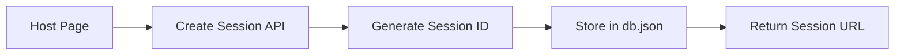
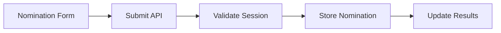

# Fish Fame - Technical Documentation

## Table of Contents
1. [Overview](#overview)
2. [Technology Stack](#technology-stack)
3. [Architecture](#architecture)
4. [Features & Implementation](#features--implementation)
5. [Data Flow](#data-flow)
6. [Deployment](#deployment)
7. [Code Structure](#code-structure)

## Overview
Fish Fame is a web application designed to facilitate "Fish of the Month" recognition programs. It allows teams to create nomination sessions, submit nominations, and view results in real-time.

## Technology Stack

### Frontend
- **React (TypeScript)**: Main frontend framework
  - Type-safe development
  - Component-based architecture
  - React Router for navigation
- **Vite**: Build tool and development server
  - Fast HMR (Hot Module Replacement)
  - Optimized production builds
- **Shadcn/UI**: UI component library
  - Modern, accessible components
  - Customizable theming
- **Lucide Icons**: Icon library
- **Tailwind CSS**: Utility-first CSS framework

### Backend
- **Node.js**: Runtime environment
- **Express.js**: Web framework
  - RESTful API endpoints
  - CORS handling
  - JSON parsing
- **File-based Storage**: Using `db.json`
  - Session management
  - Nomination storage

## Architecture

### Frontend Architecture
```
src/
├── components/     # Reusable UI components
├── lib/           # Core functionality and API
├── pages/         # Route components
├── hooks/         # Custom React hooks
└── styles/        # Global styles
```

### Backend Architecture
```
backend/
├── server.js      # Express server setup
└── db.json        # File-based database
```

## Features & Implementation

### 1. Session Management
- **Creation**:
  ```typescript
  // Frontend (api.ts)
  createSession: async (hostName: string, sessionId: string) => {
    const response = await fetch(`${API_BASE_URL}/sessions`, {
      method: 'POST',
      body: JSON.stringify({ hostName, sessionId })
    });
    return response.json();
  }

  // Backend (server.js)
  app.post('/api/sessions', async (req, res) => {
    const { hostName, sessionId } = req.body;
    db.sessions[sessionId] = {
      hostName,
      createdAt: new Date().toISOString(),
      isActive: true
    };
  });
  ```

### 2. Nomination System
- **Submission**:
  - Form validation
  - Real-time updates
  - Timestamp tracking
- **Storage**:
  - Organized by session
  - Maintains nominator and nominee info
  - Includes reasoning

### 3. Results Display
- **Real-time Updates**:
  - Nomination counts
  - Percentage calculations
  - Detailed view with reasons
- **Sorting & Filtering**:
  - Sort by nomination count
  - Filter by date

### 4. User Interface
- **Glassmorphism Design**:
  ```css
  .glassmorphism {
    background: rgba(255, 255, 255, 0.2);
    backdrop-filter: blur(10px);
    border: 1px solid rgba(255, 255, 255, 0.1);
  }
  ```
- **Responsive Layout**:
  - Mobile-first approach
  - Flexible grid system
  - Adaptive components

## Data Flow

### 1. Session Creation Flow


### 2. Nomination Flow


## Deployment

### Frontend (Vercel)
- **Configuration**:
  ```json
  // vercel.json
  {
    "rewrites": [
      {
        "source": "/(.*)",
        "destination": "/index.html"
      }
    ]
  }
  ```
- **Environment Variables**:
  ```
  VITE_API_URL=https://fish-fame-backend.onrender.com/api
  ```

### Backend (Render)
- **Configuration**:
  ```yaml
  # render.yaml
  services:
    - type: web
      name: fish-fame-backend
      env: node
      buildCommand: npm install
      startCommand: npm start
  ```

## Code Structure

### Key Components

#### 1. Host Page (`Host.tsx`)
- Session creation
- Link sharing
- Navigation to results

#### 2. Nomination Page (`Nominate.tsx`)
- Form validation
- Submission handling
- Success feedback

#### 3. Results Page (`Results.tsx`)
- Real-time updates
- Statistics calculation
- Data visualization

### API Integration (`api.ts`)
```typescript
const api = {
  createSession: async () => { ... },
  submitNomination: async () => { ... },
  getResults: async () => { ... }
};
```

## Best Practices

### 1. Error Handling
- Client-side validation
- Server-side validation
- User-friendly error messages

### 2. Performance
- Lazy loading
- Optimized builds
- Efficient data structures

### 3. Security
- CORS configuration
- Input sanitization
- Environment variables

## Usage Examples

### 1. Creating a Session
```javascript
// Host creates a session
const session = await api.createSession("John Doe", nanoid());
const nominationUrl = `/nominate/${session.sessionId}`;
```

### 2. Submitting a Nomination
```javascript
// Team member submits nomination
await api.submitNomination(sessionId, {
  nomineeName: "Jane Smith",
  reason: "Outstanding contribution to project X"
});
```

### 3. Viewing Results
```javascript
// Host views results
const results = await api.getResults(sessionId);
const topNominee = results.reduce((max, nom) => 
  nom.count > max.count ? nom : max
);
```

## Maintenance and Updates

### 1. Adding New Features
- Follow component structure
- Update documentation
- Test thoroughly

### 2. Troubleshooting
- Check server logs
- Verify environment variables
- Test API endpoints

## Future Enhancements
1. Database integration
2. Authentication system
3. Export functionality
4. Historical data tracking

---

For any questions or support, please contact the development team. 